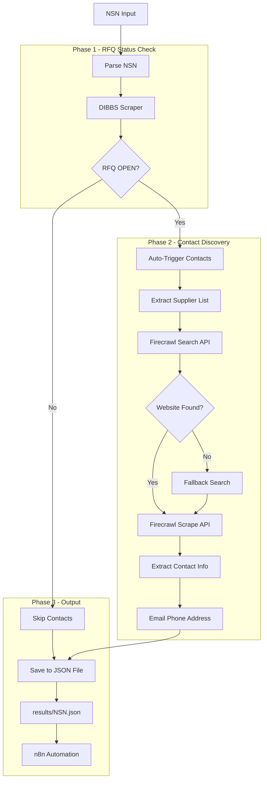

# RFQ Automation Scraper

Multi-source NSN/RFQ data scraper for government procurement automation with supplier contact discovery.

## Overview

This tool scrapes Request for Quote (RFQ) data from multiple sources and discovers supplier contact information:

- **DIBBS** (Defense Logistics Agency Internet Bid Board System) - Primary source for OPEN RFQ status
- **WBParts** - Secondary source for manufacturer details and technical specifications
- **Firecrawl** - AI-powered web scraping for supplier contact discovery

## Workflow Diagram



### Flow Summary

1. **NSN Input** → DIBBS scraper checks RFQ status
2. **If OPEN** → Automatically discovers supplier contacts via Firecrawl
3. **If NOT OPEN** → Skips contact discovery (use `--contacts` to force)
4. **Output** → JSON saved to `./results/<NSN>.json`

## Features

- **Automatic contact discovery** when RFQ is OPEN (no flag needed)
- Automatic DoD consent banner handling
- Multi-source data combination with unified JSON output
- **JSON file output** to `./results/<NSN>.json`
- Batch processing support
- OPEN/CLOSED RFQ status detection
- Manufacturer and CAGE code extraction
- Supplier contact discovery via Firecrawl API
- Configurable via environment variables

## Installation

```bash
npm install
npx playwright install chromium
```

## Configuration

Copy `.env.example` to `.env` and configure:

```bash
cp .env.example .env
```

Key environment variables:
- `FIRECRAWL_API_KEY` - Required for automatic contact discovery
- `DIBBS_BASE_URL` - DIBBS endpoint (default provided)
- `WBPARTS_BASE_URL` - WBParts endpoint (default provided)
- `SCRAPE_TIMEOUT` - Timeout in ms (default: 30000)

## Usage

### Default (Auto-Contact Discovery)
```bash
# Automatically discovers contacts if RFQ is OPEN
npx tsx src/index.ts <NSN>
npx tsx src/index.ts 4520-01-261-9675
# Output: ./results/4520-01-261-9675.json
```

### Combined DIBBS + WBParts
```bash
npx tsx src/index.ts <NSN> --wbparts
npx tsx src/index.ts 4520-01-261-9675 --wbparts
```

### WBParts Only
```bash
npx tsx src/index.ts <NSN> --wbparts-only
```

### Contact Discovery Options
```bash
# Skip contact discovery even if OPEN
npx tsx src/index.ts <NSN> --no-contacts

# Force contact discovery even if NOT OPEN
npx tsx src/index.ts <NSN> --contacts

# Look up ALL suppliers (not just primary)
npx tsx src/index.ts <NSN> --all
```

### Custom Output Directory
```bash
npx tsx src/index.ts <NSN> --output ./my-results
```

### Batch Mode
```bash
npx tsx src/index.ts <NSN1>,<NSN2>,<NSN3>
npx tsx src/index.ts 4520-01-261-9675,4030-01-097-6471 --wbparts
```

### Help
```bash
npx tsx src/index.ts --help
```

## CLI Options

| Flag | Short | Description |
|------|-------|-------------|
| `--wbparts` | `-w` | Include WBParts data |
| `--wbparts-only` | `-W` | Only scrape from WBParts |
| `--no-contacts` | | Skip contact discovery even if RFQ is OPEN |
| `--contacts` | `-c` | Force contact discovery even if RFQ is NOT OPEN |
| `--all` | `-a` | Look up all suppliers (not just primary) |
| `--output` | `-o` | Output directory (default: `./results`) |
| `--help` | `-h` | Show help |

## Output Format

Results are saved to JSON files in `./results/<NSN>.json`. Log messages go to stderr.
JSON is also printed to stdout for piping.

### With Contacts (OPEN RFQ or --contacts)
```json
{
  "nsn": "4520-01-261-9675",
  "itemName": "HEATER,VENTILATION",
  "hasOpenRFQ": true,
  "suppliers": [
    {
      "companyName": "INDEECO LLC",
      "cageCode": "74924",
      "partNumber": "210-19082-42",
      "contact": {
        "email": "sales@indeeco.com",
        "phone": "314-644-4300",
        "address": "425 Hanley Industrial Ct, St. Louis, MO",
        "website": "https://indeeco.com",
        "confidence": "high"
      }
    }
  ],
  "workflow": {
    "dibbsStatus": "success",
    "wbpartsStatus": "skipped",
    "firecrawlStatus": "success"
  }
}
```

### DIBBS-only Output
```json
{
  "success": true,
  "data": {
    "nsn": "4520-01-261-9675",
    "nomenclature": "HEATER,VENTILATION",
    "approvedSources": [
      {
        "cageCode": "74924",
        "partNumber": "210-19082-42",
        "companyName": "INDEECO LLC"
      }
    ],
    "solicitations": [...],
    "hasOpenRFQs": false
  }
}
```

### Combined Output (--wbparts)
```json
{
  "success": true,
  "data": {
    "dibbs": {...},
    "wbparts": {...},
    "hasOpenRFQ": false,
    "primaryCompany": "INDEECO LLC",
    "primaryCageCode": "74924",
    "summary": {
      "nsn": "4520-01-261-9675",
      "companyNames": ["INDEECO LLC"],
      "cageCodes": ["74924"],
      "partNumbers": [...]
    }
  }
}
```

## Data Sources

| Source | URL | Purpose |
|--------|-----|---------|
| DIBBS | `dibbs.bsm.dla.mil` | OPEN status (source of truth), solicitations |
| WBParts | `wbparts.com` | Manufacturer details, technical specs |
| Firecrawl | `firecrawl.dev` | Supplier website discovery, contact extraction |

## Project Structure

```
src/
├── index.ts            # CLI entry point
├── config.ts           # Configuration loader
├── types.ts            # TypeScript interfaces
├── dibbs-scraper.ts    # DIBBS scraping logic
├── wbparts-scraper.ts  # WBParts scraping logic
└── firecrawl-client.ts # Firecrawl API integration
```

## Test NSNs

These NSNs are confirmed working for testing:

1. `4520-01-261-9675` - INDEECO LLC (Heater, Ventilation) - OPEN RFQ
2. `4030-01-097-6471` - Shackle, Special - OPEN RFQ

## Deployment Options

### Option 1: Local CLI
```bash
npx tsx src/index.ts <NSN>
```
Best for: Development, testing, manual checks

### Option 2: n8n Integration
Use the Execute Command node:
```
cd /path/to/rfq-automation && npx tsx src/index.ts {{$json.nsn}}
```
Results are saved to `./results/{{$json.nsn}}.json` - parse the file or use stdout.
Best for: Scheduled automation, batch processing, CRM integration

### Option 3: Docker Container
```dockerfile
FROM node:20-slim
RUN npx playwright install-deps chromium
WORKDIR /app
COPY . .
RUN npm install && npx playwright install chromium
ENTRYPOINT ["npx", "tsx", "src/index.ts"]
```
Run with:
```bash
docker build -t rfq-scraper .
docker run --env-file .env -v $(pwd)/results:/app/results rfq-scraper 4520-01-261-9675
```
Best for: Consistent environments, CI/CD pipelines

### Option 4: Serverless (AWS Lambda / Vercel)
Considerations:
- Playwright requires chromium layer (~50MB)
- Cold start time ~5-10 seconds
- Timeout limits (Lambda: 15min, Vercel: 60s)

Best for: Low-volume, event-driven use

### Option 5: Long-Running Server
Create an Express/Fastify API wrapper:
```typescript
// Example: POST /scrape { nsn: "4520-01-261-9675", contacts: true }
```
Add queue system (Bull/BullMQ) for batch jobs.

Best for: High-volume, real-time API access

## Environment Variables

| Variable | Description | Default |
|----------|-------------|---------|
| `FIRECRAWL_API_KEY` | Firecrawl API key | (required for auto-contact discovery) |
| `DIBBS_BASE_URL` | DIBBS endpoint | `https://www.dibbs.bsm.dla.mil/rfq/rfqnsn.aspx` |
| `WBPARTS_BASE_URL` | WBParts endpoint | `https://www.wbparts.com/rfq` |
| `SCRAPE_TIMEOUT` | Scraper timeout (ms) | `30000` |
| `FIRECRAWL_TIMEOUT` | Firecrawl timeout (ms) | `60000` |
| `MAX_RETRIES` | Max retry attempts | `3` |
| `BATCH_DELAY` | Delay between requests (ms) | `500` |
| `HEADLESS` | Run browser headless | `true` |

## License

MIT
