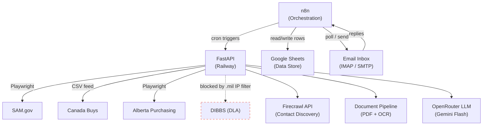
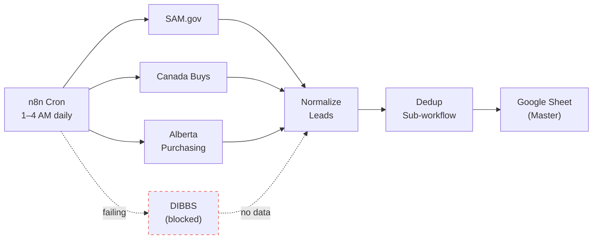
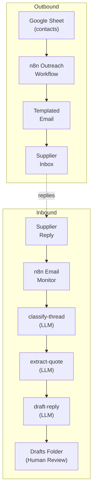
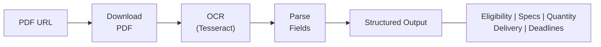
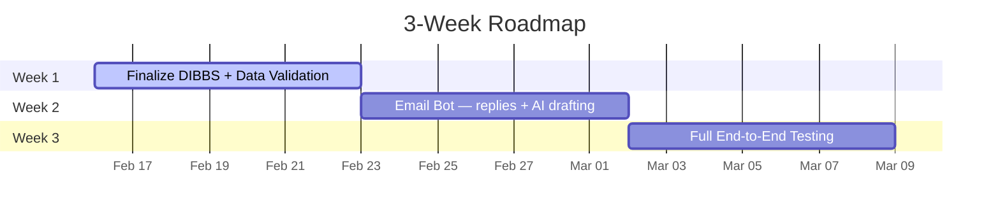

# RFQ Automation — Architecture Overview

Visual guide to the system's components, data flows, and project timeline.

## 1. System Overview

All components and how they connect — n8n orchestrates, FastAPI does the work, Google Sheets stores the data.

## 2. Daily Scraping Pipeline

Four government sources feed into a single normalized Google Sheet. Runs on cron between 1–4 AM daily.

## 3. Email Automation Flow

Two paths: outbound outreach to suppliers and inbound reply handling with LLM intelligence.

## 4. Document Intelligence

PDF bid packages are downloaded, OCR'd, and parsed into structured fields.

## 5. Roadmap

Three-week roadmap from current state through full end-to-end testing.

