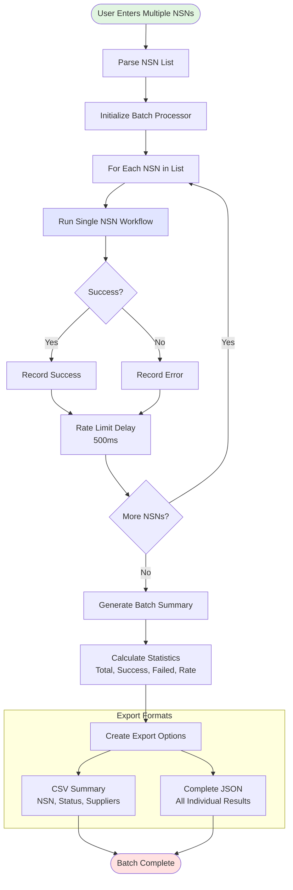
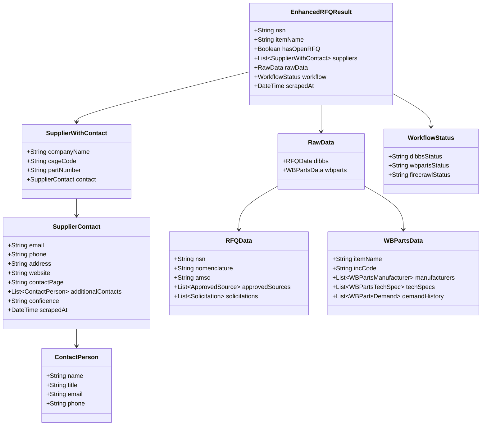
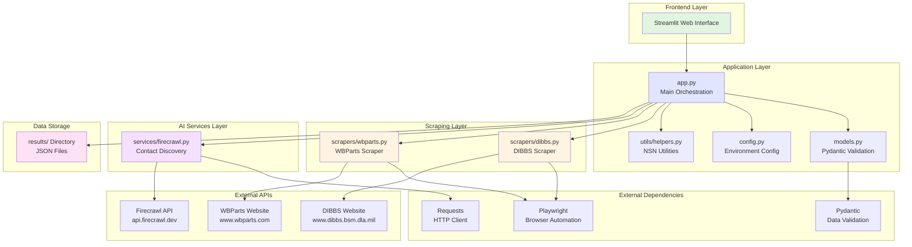

# RFQ Automation - Architecture Documentation

## Overview

This document provides comprehensive architecture diagrams for the RFQ (Request for Quote) Automation application. The application automates the collection of military/government National Stock Number (NSN) data by scraping multiple sources and using AI-powered contact discovery.

## Table of Contents

1. [Main Workflow Diagram](#main-workflow-diagram)
2. [Batch Processing Workflow](#batch-processing-workflow)
3. [Data Model Structure](#data-model-structure)
4. [Technology Stack](#technology-stack)

---

## Main Workflow Diagram

This flowchart shows the complete behind-the-scenes process from user input to final JSON output, including all three stages of data collection, aggregation, and contact discovery.

```mermaid
flowchart TB
    Start([User Enters NSN]) --> Validate{Validate NSN Format}
    Validate -->|Invalid| Error1[Display Error]
    Validate -->|Valid| Parallel[Initiate Parallel Scraping]

    subgraph "Stage 1: Parallel Data Collection"
        Parallel --> DIBBS[DIBBS Scraper]
        Parallel --> WBParts[WBParts Scraper]

        subgraph "DIBBS Scraping Process"
            DIBBS --> D1[Launch Playwright Browser]
            D1 --> D2[Navigate to DIBBS URL]
            D2 --> D3[Handle Consent Banner]
            D3 --> D4[Extract Header Info<br/>NSN, Nomenclature, AMSC]
            D4 --> D5[Extract Approved Sources<br/>CAGE, Company, Part#]
            D5 --> D6[Extract Solicitations<br/>RFQ Numbers, Dates, Qty]
            D6 --> D7[Calculate Open RFQ Status]
            D7 --> D8[Return RFQData]
        end

        subgraph "WBParts Scraping Process"
            WBParts --> W1[Launch Playwright Browser]
            W1 --> W2[Navigate to WBParts URL]
            W2 --> W3{Page Found?}
            W3 -->|404| W4[Return Empty Data]
            W3 -->|Yes| W5[Extract Basic Info<br/>Item Name, INC Code]
            W5 --> W6[Extract Manufacturers<br/>Company, CAGE Code]
            W6 --> W7[Extract Tech Specs<br/>Specifications]
            W7 --> W8[Extract Demand History<br/>Past Requests]
            W8 --> W9[Validate CAGE Codes]
            W9 --> W10[Return WBPartsData]
        end
    end

    D8 --> Aggregate[Aggregate Suppliers]
    W10 --> Aggregate
    W4 --> Aggregate

    subgraph "Stage 2: Supplier Aggregation"
        Aggregate --> AG1[Combine DIBBS + WBParts Suppliers]
        AG1 --> AG2[Deduplicate by<br/>Company Name + CAGE Code]
        AG2 --> AG3[Create Unique Supplier List]
    end

    AG3 --> ContactDiscovery[Contact Discovery Phase]

    subgraph "Stage 3: Contact Discovery"
        ContactDiscovery --> CD1[For Each Supplier]

        subgraph "Firecrawl AI Process"
            CD1 --> F1[Search Supplier Website]
            F1 --> F2[Try Query 1:<br/>Company Name + Contact]
            F2 --> F3{Found?}
            F3 -->|No| F4[Try Query 2:<br/>Company + CAGE Code]
            F4 --> F5{Found?}
            F5 -->|No| F6[Try Query 3:<br/>Company Name Only]
            F6 --> F7{Found?}
            F7 -->|No| F8[Skip Contact Discovery]
            F3 -->|Yes| F9[Filter Social Media Domains]
            F5 -->|Yes| F9
            F7 -->|Yes| F9
            F9 --> F10[Extract Contact Info<br/>via AI Scraping]
            F10 --> F11[Try Main URL]
            F11 --> F12{Contacts Found?}
            F12 -->|No| F13[Try /contact Page]
            F13 --> F14{Contacts Found?}
            F14 -->|No| F15[Return Empty Contact]
            F12 -->|Yes| F16[Parse Structured Data<br/>Email, Phone, Address]
            F14 -->|Yes| F16
            F16 --> F17[Calculate Confidence<br/>High/Medium/Low]
            F17 --> F18[Return SupplierContact]
        end

        F18 --> CD2[Attach Contact to Supplier]
        F8 --> CD2
        F15 --> CD2
        CD2 --> CD3{More Suppliers?}
        CD3 -->|Yes| CD1
        CD3 -->|No| CD4[All Contacts Discovered]
    end

    CD4 --> Assemble[Assemble Final Result]

    subgraph "Stage 4: Result Assembly"
        Assemble --> A1[Create EnhancedRFQResult]
        A1 --> A2[Add NSN & Item Name]
        A2 --> A3[Add hasOpenRFQ Status]
        A3 --> A4[Add Suppliers with Contacts]
        A4 --> A5[Add Raw DIBBS Data]
        A5 --> A6[Add Raw WBParts Data]
        A6 --> A7[Add Workflow Status]
        A7 --> A8[Add Timestamp]
    end

    A8 --> Save[Save to JSON File]

    subgraph "Output Generation"
        Save --> S1[Format NSN with Dashes]
        S1 --> S2[Create Filename:<br/>results/NSN.json]
        S2 --> S3[Write Pretty JSON<br/>2-space Indent]
        S3 --> S4[Preserve UTF-8 Encoding]
    end

    S4 --> Display[Display Results in UI]

    subgraph "Streamlit UI Display"
        Display --> U1[Show Success Message]
        U1 --> U2[Render Supplier Cards<br/>Expandable Sections]
        U2 --> U3[Display Contact Info<br/>Email, Phone, Website]
        U3 --> U4[Show Raw Data Tabs<br/>DIBBS & WBParts]
        U4 --> U5[Provide Download Button<br/>JSON File]
    end

    U5 --> End([Process Complete])
    Error1 --> End

    style Start fill:#e1f5e1
    style End fill:#ffe1e1
    style Parallel fill:#e1e5ff
    style Aggregate fill:#fff4e1
    style ContactDiscovery fill:#f5e1ff
    style Assemble fill:#e1f5ff
    style Save fill:#ffe1f5
    style Display fill:#f5ffe1
```

### Key Workflow Features

- **Parallel Scraping**: DIBBS and WBParts are scraped simultaneously for performance
- **AI-Powered Contact Discovery**: Firecrawl uses cascading search queries and intelligent extraction
- **Robust Error Handling**: Retries, fallbacks, and graceful degradation at each stage
- **Data Validation**: Pydantic models ensure data integrity throughout the pipeline

---

## Batch Processing Workflow

This diagram shows how the application processes multiple NSNs sequentially with rate limiting and error resilience.

### Batch Processing Features

- **Sequential Processing**: One NSN at a time to prevent memory issues
- **Rate Limiting**: 500ms delay between NSNs prevents API throttling
- **Error Resilience**: Individual failures don't stop the entire batch
- **Multiple Export Formats**: CSV summary and complete JSON results

---

## Data Model Structure

This class diagram shows the complete data hierarchy and relationships between all models in the application.

### Data Model Notes

- **Pydantic Validation**: All models use Pydantic for strong type validation
- **Nested Structures**: Complex hierarchical data with proper relationships
- **Raw Data Preservation**: Complete DIBBS and WBParts data retained for reference
- **Status Tracking**: Workflow status tracks success/failure of each stage

---

## Technology Stack

This diagram shows all layers of the application architecture, from the UI to external APIs and data storage.

### Technology Stack Components

#### Frontend Layer
- **Streamlit**: Modern web UI with real-time updates and interactive components

#### Application Layer
- **app.py**: Main orchestration logic for single and batch processing
- **models.py**: Pydantic data models with validation
- **config.py**: Environment configuration management
- **utils/helpers.py**: NSN formatting, validation, and file I/O utilities

#### Scraping Layer
- **scrapers/dibbs.py**: Defense Logistics Agency scraper (Playwright-based)
- **scrapers/wbparts.py**: WBParts manufacturer data scraper (Playwright-based)

#### AI Services Layer
- **services/firecrawl.py**: AI-powered contact discovery using Firecrawl API v2

#### External Dependencies
- **Playwright 1.40.0+**: Headless browser automation for scraping
- **Requests 2.31.0+**: HTTP client for API calls
- **Pydantic 2.5.0+**: Data validation and type checking

#### External APIs
- **DIBBS**: Defense Internet Bid Board System (government RFQ source)
- **WBParts**: Parts database with manufacturer and technical data
- **Firecrawl**: AI-powered web scraping and data extraction API

#### Data Storage
- **results/ Directory**: JSON files with complete RFQ data and contacts

---

## Performance Characteristics

### Timing
- **Single NSN**: ~20-30 seconds
  - DIBBS scraping: ~5 seconds
  - WBParts scraping: ~3 seconds
  - Contact discovery: ~15 seconds per supplier
- **Batch Processing**: ~25-35 seconds per NSN (including 500ms rate limiting)

### Resource Usage
- **Memory**: ~5-10KB per result in session state
- **Network**: 3+ requests per NSN (DIBBS, WBParts, Firecrawl search/scrape per supplier)
- **Browser**: Headless Chromium instance per scraping operation

### Scalability
- Sequential batch processing prevents memory issues
- No hard limit on batch size
- Rate limiting prevents API throttling
- Error resilience ensures partial results even with failures

---

## Error Handling Strategy

### Retry Mechanisms
- DIBBS: 3 retries with 1-second delay
- Browser timeouts: 30 seconds for scraping, 60 seconds for Firecrawl
- Individual NSN failures don't affect batch processing

### Fallback Strategies
- Missing Firecrawl API key → Skip contact discovery
- 404 on WBParts → Return empty data
- Search failures → Try alternate query patterns
- Contact page not found → Try main URL

### Status Tracking
- Workflow status per stage (success/error/skipped/partial)
- Confidence scoring for contact data quality
- Error messages preserved in results for debugging

---

## Viewing These Diagrams

These diagrams use Mermaid syntax and can be viewed in:
- **GitHub**: Automatically renders Mermaid diagrams
- **VS Code**: Install Mermaid Preview extension
- **JetBrains IDEs**: Built-in Mermaid support
- **Online**: [Mermaid Live Editor](https://mermaid.live)

---

*Generated: 2026-01-05*
